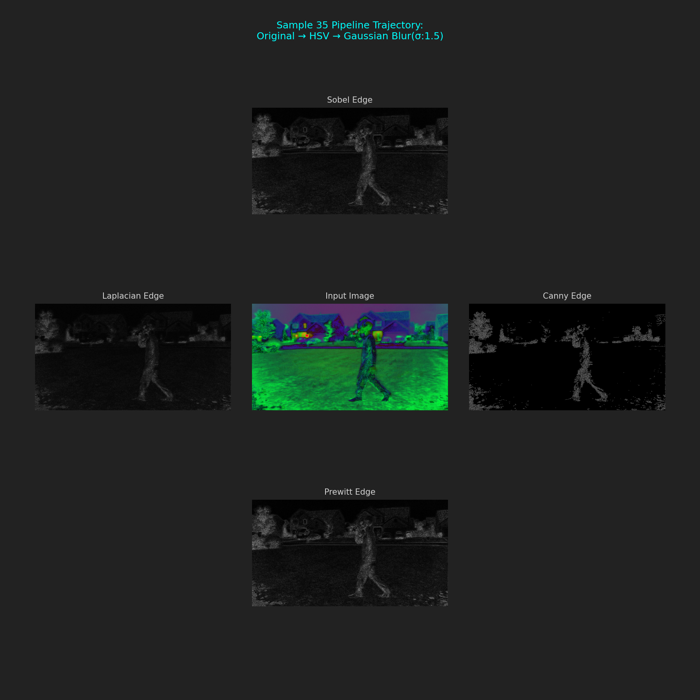
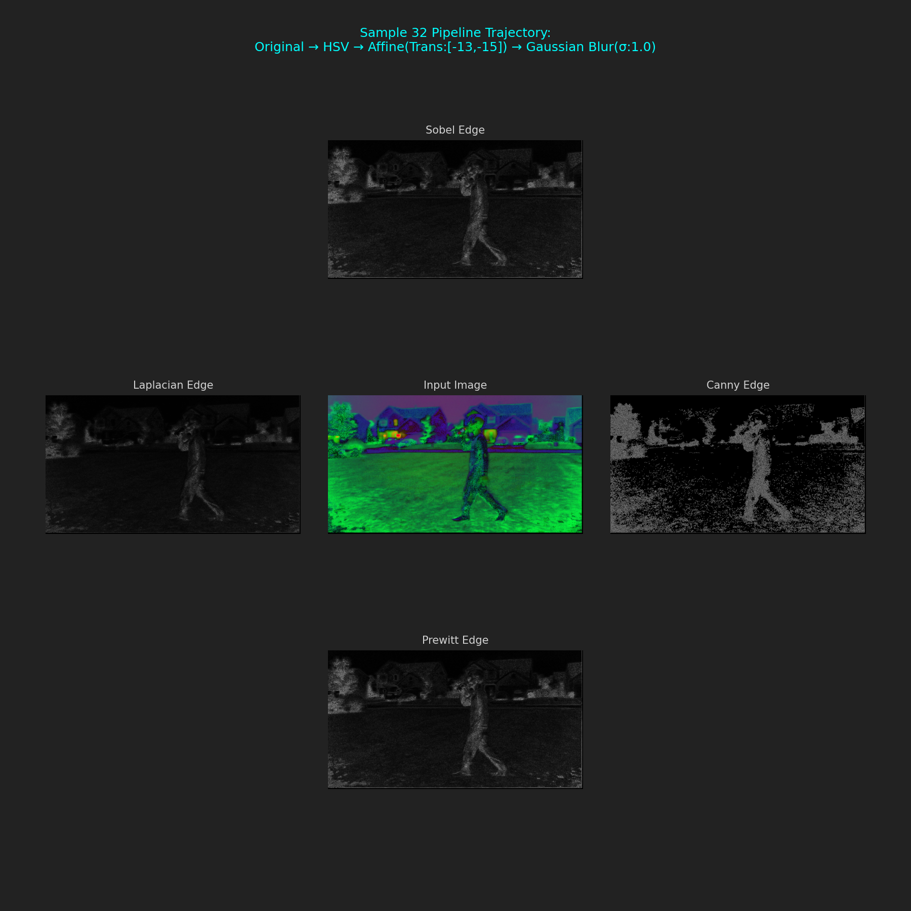
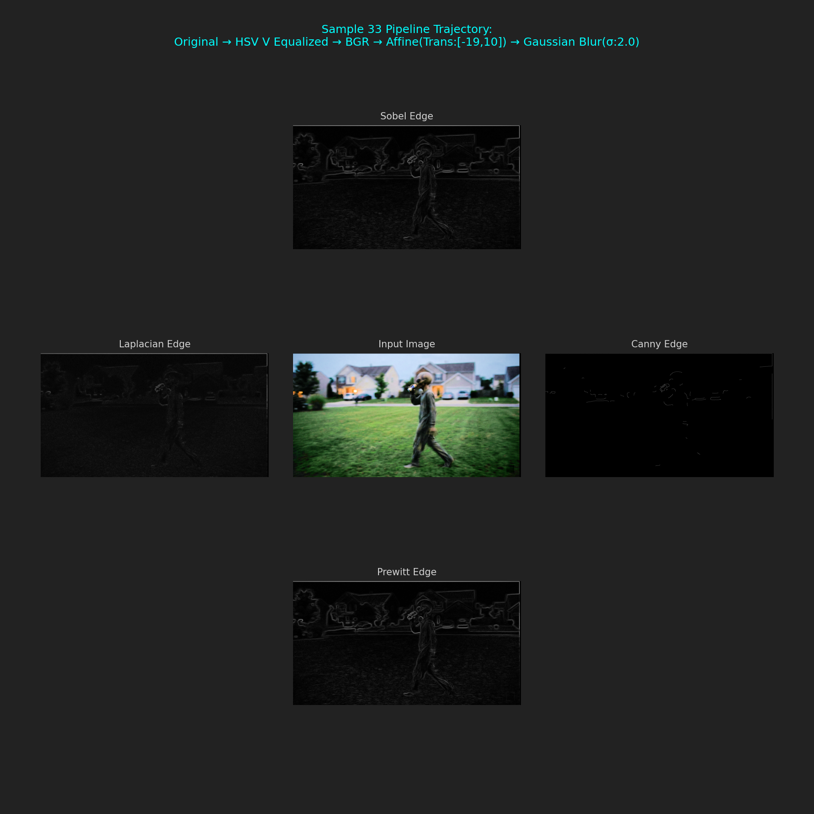
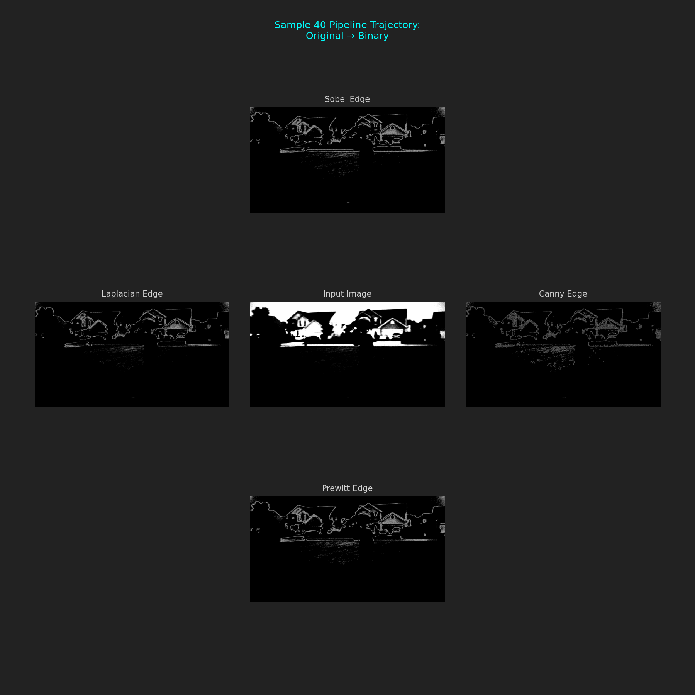
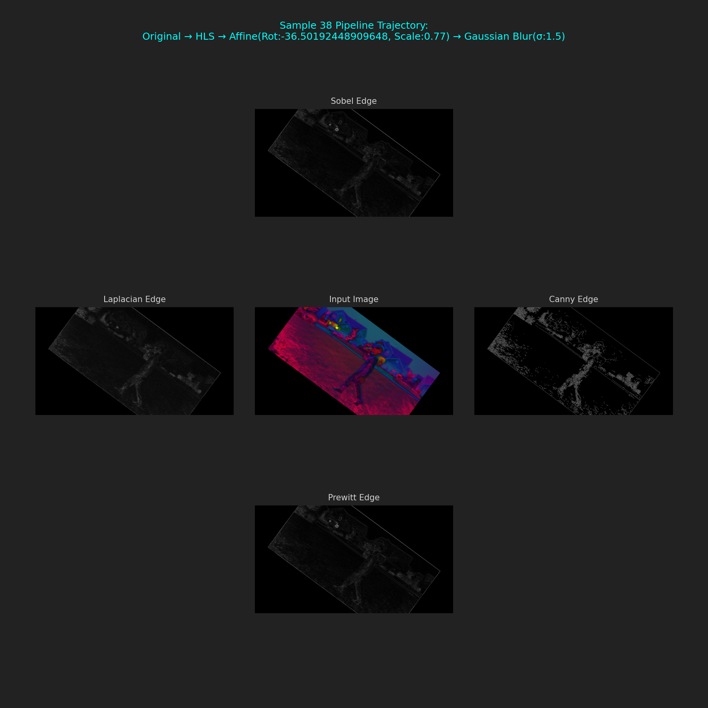
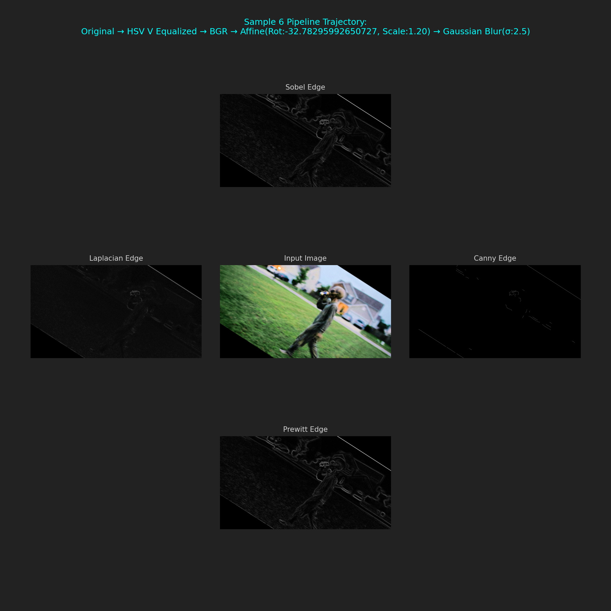

## EthanZahner-CS898BA-Project1

## CS 898BA – Image Analysis and Computer Vision
## Homework One

## Project Description

This project uses Python and OpenCV to do basic image analysis and processsing on an image. The goal of the assignment is to take an original image, analyze it, convert it into different formats, apply transformations, and then apply Gaussian blur at different sigma levels.

The project also includes a basic Hello World script, an AI usage log, and this README file.

## Programs and Libraries Used

Python
OpenCV
NumPy
VSCode
Git/GitHub

## Project Files

hello_world.py
This is the first script for the project. It prints Hello World.

src/part2.py
This is the main script for Part 2. It loads the image, calculates statistics, creates different versions of the image, applies affine transformations, and applies Gaussian blur.

AI_Log.md
This file keeps track of AI usage for the project.

requirements.txt
This file lists the Python libraries needed to run the project.

images/input/
This folder stores the original image.

images/output/part2/
This folder stores all of the processed images and the statistics CSV file.

## Setup Instructions

1. Open the project folder in VSCode.

2. Create a virtual environment.

py -m venv .venv

3. Activate the virtual environment.

..venv\Scripts\Activate.ps1

4. Install the required libraries.

pip install -r requirements.txt

## Running the Hello World Script

To run the Hello World script:

python hello_world.py

The expected output is:

Hello World!

## Running the Part 2 Script

The original image should be placed in this folder:

images/input/

The script currently expects the image to be named:

alien.png

If the image has a different name, the file path in src/part2_processing.py needs to be changed.

To run the Part 2 script:

python src/part2.py

The output images will be saved in:

images/output/part2/

## Part 2 Explanation

For Part 2, the script first loads the original image. It then calculates statistics for each color channel of the original image. Since OpenCV readss images in BGR order, the channels are Blue, Green, and Red.

The statistics calculated for each channel are:

minimum
maximum
average
median
mode
skew
range
standard deviation
variance

These statistics are saved to a CSV file called:

original_image_channel_statistics.csv

The script then creates the 7 starting images:

original image
grayscale image
binary image
HSV image
CIELAB image
HLS image
HSV value-channel equalized image converted back to a normal color image

grayscale simplifies the image into brightness values instead of color. The binary image turns it into mostly black and white values. HSV, CIELAB, and HLS are different color spaces that separate color and brightness in different ways

For the HSV image, the script does histogram equalization on the V channel. The V channel shows value, or brightness. Eqaulizing this channel helps normalize the lighting and improve contrast without directly changing the hue and saturation channels.

After making the starting images, the script performs 2 affine transformations on each imageto make a total of 14 transformed images.

The transformations used are:

rotation with scaling
translation

The script uses random values with a seed so the results are random but repeatable

There are now:
7 starting images
14 transformed images

After that, Gaussian blur is applied to each of the 21 images.

The sigma values used are:

0.5
1.0
1.5
2.0
2.5
3.0
3.5

This creates 147 blurred images because 21 images are each blurred 7 times.

The total number of images after Part 2 is:

21 original/transformed images + 147 blurred images = 168 images

## Gaussian Blur Discussion

Gaussian blur smooths an image. A lower sigma value causes less blur, and a higher sigma value causes more blur.

At sigma 0.5, the image is only slightly blurred and most details are still visible.

At sigma 1.0, the blur is more noticeable, but the image still keeps most of its shape and detail.

At sigma 1.5 and 2.0, small details start to disappear and edges become softer.

At sigma 2.5 and 3.0, the image becomes much smoother and fine details are harder to see.

At sigma 3.5, the blur is the strongest. The image loses a lot of sharpness, and object boundaries are less clear.

increasing sigma makes the image smoother, but it also removes detail. Lower sigma values are better for keeping detail and higher sigma values are better for stronger smoothing.

## Expected Part 2 Output

The Part 2 script should create:

7 base images
14 affine-transformed images
147 Gaussian-blurred images

This gives a total of 168 images.
The script also creates one CSV file with the original image statistics

## Part 3 Edge Detection

To run the Part 3 edge detection script:

python src/part3.py

The script uses the 168 images from images/output/part2/ and creates 4 random subsets of 42 images. I used subset 1 for the edge detection part.

The output is saved in:

images/output/part3/

For Part 3, I randomly divided the 168 images from Part 2 into 4 equal subsets. Each subset had 42 images. I selected one subset (subset 1) and used those 42 images for edge detection.

For each image, I saved the original selected input image and then created four edge-detected versions using Sobel, Laplacian, Canny, and Prewitt edge detection.

This created 210 images total:

42 input images
42 Sobel edge images
42 Laplacian edge images
42 Canny edge images
42 Prewitt edge images

I also created 42 five-image plots. Each plot shows the input image next to the four edge-detected versions. Six random plots were selected to include in this README.

## Best edge detection (highlighting changes in brightness/color):

1: Canny had the best with outlined white edges against a stark black, Sobel and Prewitt were very similar but I think had too much fuzz, Laplacian is a good balance, but Canny highlights just the edges better

2: Laplacian is the worse and completely dark while Sobel and Prewitt do highlight the edges of the background, they completely miss the alien subject, Canny is too grainy to make out any good edge. I think the best here is Sobel, but none are good

3: Nearly the exact same results as 2, but Laplacian is a bit brighter and Canny is a bit more clear but still overly white. Sobel and Prewitt highlight essentially 0 edges which makes me think though it doesn't highlight well, Canny is best here

4: Sobel and Prewitt are the same as 3, with essentially 0 edges being highlighted, Laplacian doesn't highlight any, canny is best by default again and is improved from 2 and 3

5: Sobel comes through the best here with prewitt close behind in my opinion, they both define every edge in the image well and show off the lighting in the source image very well. Canny is bad and entirely black and Laplacian is too white and grainy to be useful or make out any specific edge

6: I think Sobel looks really good here with Prewitt close behind once again, edges are very clear and defined with the lighting, Canny is too dark to see anything. Laplacian is useable here but not as good as the first two

7: Canny's edges aren't defined enough to be useful in this image though it is clearer, Sobel and Prewitt I think are best again though Laplacian looks very promising with how dark its background is, I just don't think it captured the changes in brightness/color as well as Sobel and Prewitt

8: None of the techniques came through with good edges here, it seems like they all struggle a lot with neutral lighting (which is the point I suppose)

9: Laplacian is too fuzzy to make out any defined edge, Prewitt and Sobel have equally viewable but weak edges. Canny looks really good here with the edges of background objects being highlighted perfectly against the background, a little tweaking to make the alien come through would make it perfect

10: Canny and Laplacian are unusable here, which is suprising because of how much better Canny did in 1, a previous hsv image, overall the results are close to 1 with Sobel and Prewitt seeming to highlight more as the gasussian sigma increases, but that also means slightly more noise.

I have 32 more images but based off of these 10 with various effects and levels of the Gaussian Blur, I think the most successful edge detection technique was the Sobel edge. I was able to gather that Sobel was very good at horizontal and vertical brightness changes but missed very faint edges, Prewitt was extremely similar to Sobel in most cases, but were simpler causing me to choose Sobel more often, Laplacian was good at finding areas where brightness changed quickly (like the grass) but was more sensitive to the noise and blur, and Canny, while when it was clear it came out the best, removed far too much detail to be useful in my opinion and didn't seem to be the best fit for my sample.

## Git Usage

This project uses Git and GitHub for version control. I forgot to make incremental commits with part 2, but they were made with part 3 as I added the project setup, code, image outputs, README updates, and AI log updates.

## AI Usage

AI was used to help explain OpenCV tools, project setup, code structure, and README writing. All AI use is recorded in AI_Log.md with the prompt, date and time, tool used, response summary, and changes made because of the response.

